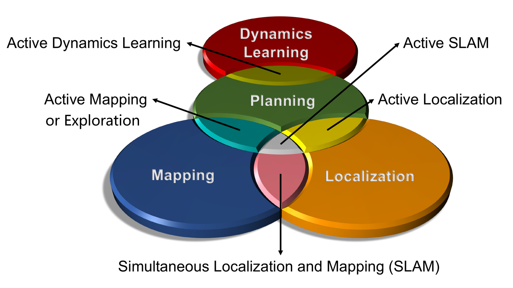

# Active SLAM Paper List

(This figure is referenced from [PyPolo](https://github.com/Weizhe-Chen/PyPolo).)

The autonomous robotic system is a key objective pursued by many researchers in the field of robotics. In recent years, advancements in state estimators, motion planning algorithms, 3D representations, and even large language models (LLMs) have led to a surge of efforts aimed at achieving autonomy through Active SLAM. This approach has become a focal point for developing systems capable of navigating and interacting with complex environments independently.

This repository organizes relevant papers in the Active SLAM domain according to the author's perspective. It is important to note that the classification used in the repository reflects the author's viewpoint; in reality, many similar works are difficult to categorize satisfactorily.

## Overview

**Table of Contents**

[TOC]

## Survey Paper

- Past, Present, and Future of Simultaneous Localization and Mapping: Toward the Robust-Perception Age, *TRO 2016*. [[Paper](https://arxiv.org/pdf/1606.05830.pdf)]
- A Survey of Deep Network Solutions for Learning Control in Robotics: From Reinforcement to Imitation, *arXiv 2016*. [[Paper](https://arxiv.org/pdf/1612.07139)]
- A Survey on the autonomous exploration of confined subterranean spaces: Perspectives from real-word and industrial robotic deployments, *RAS 2016*. [[Paper](https://www.sciencedirect.com/science/article/abs/pii/S0921889022001932)]
- A Comprehensive Review of Coverage Path  Planning in Robotics Using Classical and Heuristic  Algorithms, *IEEE Access 2021*. [[Paper](https://ieeexplore.ieee.org/abstract/document/9523743/)]
- A survey on active simultaneous localization and mapping: State of the art and new frontiers, *TRO 2023*. [[Paper](https://arxiv.org/pdf/2207.00254)]
- Active slam: A review on last decade, *Sensors 2023*. [[Paper](https://www.mdpi.com/1424-8220/23/19/8097)]
- Mobile robots exploration strategies and  requirements: A systematic mapping study, *IJRR 2025*. [[Paper](https://journals.sagepub.com/doi/abs/10.1177/02783649241313471)]
- Multi-Robot System for Cooperative Exploration in Unknown Environments: A Survey, *arXiv 2025*. [[Paper](https://arxiv.org/pdf/2503.07278)]
- A Comprehensive Survey on Coverage Path Planning for Mobile Robots in Dynamic Environments, *IEEE Access 2021*. [[Paper](https://ieeexplore.ieee.org/abstract/document/10946186)]

## PhD Thesis

-  Motion and Task Planning for Mobile Robot Navigation Under Uncertainty,  Xinyue Kan, 2021

## 1 Coverage Planning

### 1.1 Robot Coverage Planning
- Adaptive coverage path planning for efficient exploration of unknown environments, *IROS 2022*. [[Paper](https://arxiv.org/pdf/2302.03164)]
- A hierarchical multi-UAV cooperative framework for infrastructure inspection and reconstruction, *Control Theory and Technology 2024*. [[Paper](https://link.springer.com/content/pdf/10.1007/s11768-024-00202-0.pdf)]
- Anytime Replanning of Robot Coverage Paths for  Partially Unknown Environments, *TRO 2022*. [[Paper](https://ieeexplore.ieee.org/abstract/document/10665968)]

### 1.2 Sensor Coverage Planning

-  Online Exploration and Coverage Planning  in Unknown Obstacle-Cluttered Environments, *RAL 2020*. [[Paper](https://ieeexplore.ieee.org/abstract/document/9144373/)]
-  Fast-Revisit Coverage Path Planning  for Autonomous Mobile Patrol Robots  Using Long-Range Sensor Information, *IROS 2025*. [[Paper](https://arxiv.org/pdf/2501.07343)] [[Code](https://github.com/hcr-lab/fare-cpp)] 

## 2 Object Navigation

- Autonomous exploration and simultaneous object search using aerial robots, *IEEE Aerospace Conference 2018*. [[Paper](https://ieeexplore.ieee.org/abstract/document/8396632)]
- Object Goal Navigation using Goal-Oriented Semantic Exploration, *NeurIPS 2020*,  [[Paper](https://proceedings.neurips.cc/paper/2020/file/2c75cf2681788adaca63aa95ae028b22-Paper.pdf)] [[Code](https://github.com/devendrachaplot/Object-Goal-Navigation)]
- Visual Language Maps for Robot Navigation, *ICRA 2023*. [[Paper](https://arxiv.org/pdf/2210.05714)] [[Code](https://github.com/vlmaps/vlmaps)] [[Website](https://vlmaps.github.io/)]
- Vlfm: Vision-language frontier maps for zero-shot semantic navigation, *ICRA 2024*. [[Paper](https://arxiv.org/pdf/2312.03275)] [[Code](https://github.com/bdaiinstitute/vlfm)] [[Website](https://naoki.io/portfolio/vlfm)]
- ApexNav: An Adaptive Exploration Strategy for Zero-Shot Object Navigation with Target-centric Semantic Fusion, *arXiv 2025*. [[Paper](https://arxiv.org/pdf/2504.14478)] [[Website](https://arxiv.org/pdf/2504.14478)]
- FindAnything: Open-Vocabulary and Object-Centric Mapping for Robot Exploration in Any Environment, *arXiv 2025*. [[Paper](https://arxiv.org/pdf/2504.08603)]
- GET: Goal-directed Exploration and Targeting for Large-Scale Unknown Environments, *arXiv 2025*. [[Paper](https://arxiv.org/pdf/2505.20828)]
- Conscious Frontier Analysis Model: Learning-Based Path Planning for PointGoal Navigation, *TASE 2025*. [[Paper](https://ieeexplore.ieee.org/abstract/document/11015745)]
- Uncertainty-Informed Active Perception for Open Vocabulary Object Goal Navigation, *arXiv 2025*. [[Paper](https://arxiv.org/pdf/2506.13367)] [[Code](https://github.com/PRBonn/uiap-ogn)]
- Multimodal Spatial Language Maps for Robot Navigation and Manipulation, *IJRR 2025*. [[Paper](https://arxiv.org/pdf/2506.06862)] [[Code](https://github.com/avlmaps/AVLMaps)] [[Website](https://mslmaps.github.io/)]
- GaussNav: Gaussian Splatting for Visual Navigation, *TPAMI 2025*. [[Paper](https://arxiv.org/pdf/2403.11625.pdf)] [[Code](https://github.com/XiaohanLei/GaussNav)] [[Website](https://xiaohanlei.github.io/projects/GaussNav/)]
- VISTA: Open-Vocabulary, Task-Relevant Robot Exploration with Online Semantic Gaussian Splatting, *arXiv 2025*. [[Paper](https://arxiv.org/pdf/2507.01125)]

## 3 Autonomous Mapping

### 3.1 Object-level

- Active Implicit Object Reconstruction using Uncertainty-guided Next-Best-View Optimization, *RAL, 2023*. [[Paper](https://arxiv.org/pdf/2303.16739)] [[Code](https://github.com/HITSZ-NRSL/ActiveImplicitRecon)]
- Finding things in the unknown: Semantic object-centric exploration with an mav, *RAL, 2023*. [[Paper](https://arxiv.org/pdf/2302.14569)] [[Code](https://github.com/smartroboticslab/semantic-exploration-icra-2023)]
- PB-NBV: Efficient Projection-Based Next-Best-View Planning Framework for Reconstruction of Unknown Objects, *arXiv, 2025*. [[Paper](https://arxiv.org/pdf/2501.10663)] 

### 3.2 Scene-level

#### 3.1.1 Single Robot

- A frontier-based approach for autonomous exploration, *CIRA 1997*. [[Paper](http://www.robotfrontier.com/papers/cira97.pdf)]
- Simultaneous localization and map-building using active vision, *TPAMI, 2002*. [[Paper](https://d1wqtxts1xzle7.cloudfront.net/47098085/Simultaneous_20Localization_20and_20Map-Building-libre.pdf)]
- Autonomous Exploration of Visually–Degraded Environments using Aerial Robots, *ICUAS 2017*. [[Paper](https://www.researchgate.net/profile/Shehryar-Khattak/publication/318899705_Autonomous_Exploration_of_Visually-Degraded_Environments_Using_Aerial_Robots/links/604fadf892851cd8ce43f960/Autonomous-Exploration-of-Visually-Degraded-Environments-Using-Aerial-Robots.pdf)]
- Explore locally, plan globally: A path planning framework for autonomous robotic exploration in subterranean environments, *ICRA 2019*. [[Paper](https://www.researchgate.net/profile/Shehryar-Khattak/publication/336130635_Explore_Locally_Plan_Globally_A_Path_Planning_Framework_for_Autonomous_Robotic_Exploration_in_Subterranean_Environments/links/6016e5dca6fdcc071ba8fb91/Explore-Locally-Plan-Globally-A-Path-Planning-Framework-for-Autonomous-Robotic-Exploration-in-Subterranean-Environments.pdf)]
- Topological Frontier-Based Exploration and Map-Building Using Semantic Information, *Sensors 2019*. [[Paper](https://www.mdpi.com/1424-8220/19/20/4595)]
- Multisensor online 3D view planning for autonomous underwater exploration, *JFR 2020*. [[Paper](https://onlinelibrary.wiley.com/doi/abs/10.1002/rob.21951)]
- Hybrid topological and 3d dense mapping through autonomous exploration for large indoor environments, *ICRA 2020*. [[Paper](https://www.researchgate.net/profile/Clara-Gomez-5/publication/344982191_Hybrid_Topological_and_3D_Dense_Mapping_through_Autonomous_Exploration_for_Large_Indoor_Environments/links/6010383745851517ef19748d/Hybrid-Topological-and-3D-Dense-Mapping-through-Autonomous-Exploration-for-Large-Indoor-Environments.pdf)]
- Confidence-rich Localization and Mapping based on Particle Filter for Robotic Exploration, *IROS 2022*. [[Paper](https://arxiv.org/pdf/2202.09631.pdf)]
- TARE: A Hierarchical Framework for Efficiently Exploring Complex 3D Environments, *RSS 2021*. [[Paper](http://www.hongbiaoz.com/files/paper5.pdf)]
- Graph-based Topological Exploration Planning in Large-scale 3D Environments, *ICRA 2021*. [[Paper](https://arxiv.org/pdf/2103.16829)]
- Three-dimensional Terrain Aware Autonomous Exploration for Subterranean and Confined Spaces, *ICRA 2021*. [[Paper](https://ieeexplore.ieee.org/abstract/document/9561099)]
- 3D Reactive Control and Frontier-Based Exploration for Unstructured Environments, *IROS 2021*. [[Paper](https://arxiv.org/pdf/2108.00380)]
- Large-Scale Exploration of Cave Environments by Unmanned Aerial Vehicles, *RAL 2021*. [[Paper](https://arxiv.org/pdf/2303.02972)]
- A Hierarchical Approach for Mobile Robot Exploration in Pedestrian Crowd, *RAL 2022*. [[Paper](https://ieeexplore.ieee.org/abstract/document/9562274)]
- NextBestPath: Efficient 3D Mapping of Unseen Environments, *ICLR, 2025*. [[Paper](https://arxiv.org/pdf/2502.05378)] [[Website](https://shiyao-li.github.io/nbp/)]
- Metric-Free Exploration for Topological Mapping by Task and Motion Imitation in Feature Space, *RSS, 2023*. [[Paper](https://arxiv.org/pdf/2303.09192)] [[Website](https://ai4ce.github.io/DeepExplorer/)] [[Code](https://github.com/ai4ce/DeepExplorer)]
- Estimating Map Completeness in Robot Exploration, *arXiv 2024*. [[Paper](https://arxiv.org/pdf/2406.13482)]
- Enhancing Exploration Efficiency using Uncertainty-Aware Information Prediction, *arXiv 2024*. [[Paper](https://arxiv.org/pdf/2412.12825)]
- A Skeleton-Based Topological Planner for Exploration in Complex Unknown Environments, *arXiv 2024*. [[Paper](https://arxiv.org/pdf/2412.13664)] [[Code](https://github.com/Haochen-Niu/STGPlanner)]
- MapEx: Indoor Structure Exploration with Probabilistic Information Gain from Global Map Predictions, *ICRA 2025*. [[Paper](https://arxiv.org/pdf/2409.15590)] [[Code](https://github.com/castacks/MapEx)]
- HEROS: Hierarchical Exploration with Online Subregion Updating for 3D Environment Coverage, *arXiv 2024*. [[Paper](https://arxiv.org/pdf/2407.11326)] [[Code](https://github.com/bit-lsj/HEROS)]
- HPHS: Hierarchical Planning based on Hybrid Frontier Sampling for Unknown Environments Exploration, *IROS 2024*. [[Paper](https://arxiv.org/pdf/2407.10660)] [[Code](https://github.com/bit-lsj/HPHS)]
- Towards field deployment of MAVs in adaptive exploration of GPS-denied subterranean environments, *RAS 2024*. [[Paper](https://www.sciencedirect.com/science/article/pii/S0921889024000460)]
- 3D Active Metric-Semantic SLAM, *RAL 2024*. [[Paper](https://arxiv.org/pdf/2309.06950)] [[Code](https://github.com/tyuezhan/RAL24-3DAMSSLAM)]
- FALCON: Fast Autonomous Aerial Exploration Using Coverage Path Guidance, *TRO 2024*. [[Paper](https://ieeexplore.ieee.org/abstract/document/10816079)] [[Code](https://github.com/HKUST-Aerial-Robotics/FALCON)]
- Active Semantic Mapping and Pose Graph Spectral Analysis for Robot Exploration, *arXiv, 2024*. [[Paper](https://arxiv.org/pdf/2408.14726)] [[Code](https://github.com/BohemianRhapsodyz/semantic_exploration)]
- EPIC: A Lightweight LiDAR-Based UAV Exploration Framework for Large-Scale Scenarios, *RAL 2025*. [[Paper](https://arxiv.org/pdf/2410.14203)] [[Code](https://github.com/SYSU-STAR/EPIC)]
- Factor Graph-Based Active SLAM for Spacecraft Proximity Operations, *arXiv 2025*. [[Paper](https://arxiv.org/pdf/2501.10950)]
- PIPE Planner: Pathwise Information Gain with Map Predictions for Indoor Robot Exploration, *IROS 2025*. [[Paper](https://arxiv.org/pdf/2503.07504)]
- HELM: Human-Preferred Exploration with Language Models, *arXiv 2025*. [[Paper](https://arxiv.org/pdf/2503.07006)]
- Action-Aware Pro-Active Safe Exploration for Mobile Robot Mapping, *arXiv 2025*. [[Paper](https://arxiv.org/pdf/2503.09515)]
- Autonomous Exploration-Based Precise Mapping for Mobile Robots through Stepwise and Consistent Motions, *arXiv 2025*. [[Paper](https://arxiv.org/pdf/2503.17005)]
- Information Gain Is Not All You Need, *ECMR 2025*. [[Paper](https://arxiv.org/pdf/2504.01980)]
- SeGuE: Semantic Guided Exploration for Mobile Robots, *arXiv 2025*. [[Paper](https://arxiv.org/pdf/2504.03629)]
- Unlocking Full Exploration Potential of Ground Robots by Multiresolution Topological Mapping, *TII 2025*. [[Paper](https://ieeexplore.ieee.org/abstract/document/11006868)]
- Robot active neural sensing and planning in unknown cluttered environments, *TRO 2023*. [[Paper](https://ieeexplore.ieee.org/abstract/document/10101696/)]
- Understanding while Exploring: Semantics-driven Active Mapping, *arXiv 2025*. [[Paper](https://arxiv.org/pdf/2506.00225)]
- EDEN: Efficient Dual-Layer Exploration Planning for Fast UAV Autonomous Exploration in Large 3-D Environments, *arXiv 2025*. [[Paper](https://arxiv.org/pdf/2506.05106)] [[Code](https://github.com/NKU-MobFly-Robotics/EDEN)]
- HEATS: A Hierarchical Framework for Efficient Autonomous Target Search with Mobile Manipulators, *arXiv 2025*. [[Paper](https://arxiv.org/pdf/2503.07986)] [[Code](https://github.com/Andy168byte/HEATS)]
- Robust Robotic Exploration and Mapping Using Generative Occupancy Map Synthesis, *arXiv 2025*. [[Paper](https://arxiv.org/pdf/2506.20049)]
- FrontierNet: Learning Visual Cues to Explore, *RAL 2025*. [[Paper](https://arxiv.org/pdf/2501.04597)] [[Code](https://github.com/cvg/FrontierNet)]
- Omni-Explorer: A Rapid Autonomous Exploration Framework With FOV Expansion Mechanism, *IEEE Transactions on Cybernetics 2025*. [[Paper](https://ieeexplore.ieee.org/abstract/document/11077708)]
- A UAV Autonomous Exploration Method Based on High-Quality Viewpoints and Infilled Guidance, *T-Mech 2025*. [[Paper](https://ieeexplore.ieee.org/abstract/document/11082662)]
- LITE: A Learning-Integrated Topological Explorer for Multi-Floor Indoor Environments, *arXiv 2025*. [[Paper](https://arxiv.org/pdf/2507.21517)]
- Biasing Frontier–Based Exploration with Saliency Areas, *arXiv 2025*. [[Paper](https://arxiv.org/pdf/2508.10689)]
- Hierarchical Exploration of Mobile Robots by Unknown Region Division With Multiple Environment Representations, *RAL 2025*. [[Paper](https://ieeexplore.ieee.org/abstract/document/11122319)]
- Autonomous Exploration With Terrestrial-Aerial Bimodal Vehicles, *RAL 2025*. [[Paper](https://ieeexplore.ieee.org/abstract/document/11122320/)]
- Hierarchical Exploration of Mobile Robots by Unknown Region Division With Multiple Environment Representations, *RAL 2025*. [[Paper](https://ieeexplore.ieee.org/abstract/document/11122319/)]
- RUSH: Rapid UAV Spatial Hierarchical Exploration via Regional Viewpoint Generation for Large-scale Environments, *RAL 2025*. [[Paper](https://ieeexplore.ieee.org/abstract/document/11145776)]
- HIGHSTAR: High-Speed and Efficient Online Autonomous UAV Exploration, *TASE 2025*. [[Paper](https://ieeexplore.ieee.org/abstract/document/11146891)] [[Code](https://github.com/NKU-MobFly-Robotics/HighStar)]
- FIELD: Fast Information-Driven Autonomous Exploration Using Larger Perception Distance, *IROS 2025*. [[Paper-todo]()]
- FASTEX: Fast UAV Exploration in Large-Scale Environments Using Dynamically Expanding Grids and Coverage Paths, *IROS 2025*. [[Paper-todo]()]
- P2 Explore: Efficient Exploration in Unknown Cluttered Environment with Floor Plan Prediction, *IROS 2025*. [[Paper](https://arxiv.org/pdf/2409.10878)]
- Information Entropy-Assisted Hierarchical Framework for Unknown Environments Exploration, *IROS 2025*. [[Paper-todo]()]
- GRATE: a Graph transformer-based deep Reinforcement learning Approach for Time-efficient autonomous robot Exploration, *arXiv 2025*. [[Paper](https://arxiv.org/pdf/2509.12863)]
- GUIDE: A Diffusion-Based Autonomous Robot Exploration Framework Using Global Graph Inference, *arXiv 2025*. [[Paper](https://arxiv.org/pdf/2509.19916)]
- Semantic Exploration and Dense Mapping of Complex Environments Using Ground Robot With Panoramic LiDAR-Camera Fusion, *RAL 2025*. [[Paper](https://ieeexplore.ieee.org/document/11159179)]
- FLARE: Fast Large-scale Autonomous Exploration Guided by Unknown Regions, *RAL 2025*. [[Paper](https://ieeexplore.ieee.org/abstract/document/11202253)]
- Learning to Explore Efficiently: Heterogeneous Topological Graphs and Lightweight Global Reasoning for Robotic Exploration, *RAL 2025*. [[Paper](https://ieeexplore.ieee.org/abstract/document/11206341)]
- SEA: Semantic Map Prediction for Active Exploration of Uncertain Areas, *arXiv 2025*. [[Paper](https://arxiv.org/pdf/2510.19766v1)] [[Website](https://robo-lavira.github.io/sea-active-exp/)]
- TIPS: Tiered Information-Rich Planning Strategy for Efficient UGV Autonomous Exploration, *RAL 2025*. [[Paper](https://ieeexplore.ieee.org/abstract/document/11214391)]
- BATO: Bayesian Trajectory Optimization for Active Environmental Mapping Using Autonomous Robots, *T-Mech 2025*. [[Paper](https://ieeexplore.ieee.org/abstract/document/11216354)]
- TIPS: Tiered Information-Rich Planning Strategy for Efficient AGV Autonomous Exploration, *RAL 2025*. [[Paper](https://ieeexplore.ieee.org/document/11214391/)]
- Energy-Aware UAV Coverage Planning in Mountainous Terrain via Contour-Aligned Path Generation, *RAL 2025*. [[Paper](https://ieeexplore.ieee.org/document/11204479)]
- PUL-SLAM: Path-Uncertainty Co-Optimization with Lightweight Stagnation Detection for Efficient Robotic Exploration, *Sensors 2025*. [[Paper](https://arxiv.org/pdf/2511.04180v1)]

#### 3.1.2 Multi-robot System

- Multi-Robot Collaborative Dense Scene Reconstruction, *TOG 2019*. [[Paper](https://kevinkaixu.net/papers/dong_sig19_multirobot.pdf)]
- Multi-Robot Active Mapping via Neural Bipartite Graph Matching, *CVPR 2022*. [[Paper](https://openaccess.thecvf.com/content/CVPR2022/papers/Ye_Multi-Robot_Active_Mapping_via_Neural_Bipartite_Graph_Matching_CVPR_2022_paper.pdf)]
- Frontier-Based Exploration for Multi-Robot Rendezvous in Communication-Restricted Unknown Environments, *arXiv 2024*. [[Paper](https://arxiv.org/pdf/2403.11617)]
- Multi-Agent Autonomy: Advancements and Challenges in Subterranean Exploration, *arXiv 2021*. [[Paper](https://arxiv.org/pdf/2110.04390)]
- WiSER-X: Wireless Signals-based Efficient Decentralized Multi-Robot Exploration without Explicit Information Exchange, *arXiv 2021*. [[Paper](https://arxiv.org/pdf/2412.19876)]
- SOAR: Simultaneous Exploration and Photographing with Heterogeneous UAVs for Fast Autonomous Reconstruction, *IROS 2024*. [[Paper](https://arxiv.org/pdf/2409.02738)] [[Code](https://github.com/SYSU-STAR/SOAR)] [[Website](https://sysu-star.github.io/SOAR/)]
- Map Prediction and Generative Entropy for Multi-Agent Exploration, *arXiv 2025*. [[Paper](https://arxiv.org/pdf/2501.13189)]
- A Multi-Robot Exploration Planner for Space Applications, *RAL 2025*. [[Paper](https://ieeexplore.ieee.org/abstract/document/10847879)] [[Code](https://github.com/MISTLab/MGGPlanner)]
- AAGE: Air-Assisted Ground Robotic Autonomous Exploration in Large-Scale Unknown Environments, *TRO 2025*. [[Paper](https://ieeexplore.ieee.org/abstract/document/10891932)]
- Realm: Real-Time Line-of-Sight Maintenance in Multi-Robot Navigation with Unknown Obstacles, *ICRA 2025*. [[Paper](https://arxiv.org/pdf/2502.15162)] [[Code](https://arxiv.org/pdf/2502.15162)]
- A Hierarchical Region-Based Approach for Efficient Multi-Robot Exploration, *arXiv 2025*. [[Paper](https://arxiv.org/pdf/2503.12876)]
- A Hierarchical Graph-Based Terrain-Aware Autonomous Navigation Approach for Complementary Multimodal Ground-Aerial Exploration, *arXiv 2025*. [[Paper](https://arxiv.org/pdf/2505.14859)]
- MEF-Explore: Communication-Constrained Multi-Robot Entropy-Field-Based Exploration, *TASE 2025*. [[Paper](https://arxiv.org/pdf/2505.23376)]
- PC-Explorer: Decentralized Multi-UAV Exploration in Bandwidth-Limited Environments, *RAL 2025*. [[Paper](https://ieeexplore.ieee.org/abstract/document/11091481)]
- MoRoCo: Multi-operator-robot Coordination, Interaction and Exploration under Restricted Communication, *arXiv 2025*. [[Paper](https://arxiv.org/pdf/2508.07657)]
- Collaborative Exploration with a Marsupial Ground-Aerial Robot Team through Task-Driven Map Compression, *RAL 2025*. [[Paper-todo]()] [[Website](https://ntnu-arl.github.io/marsupial-collaborative-exploration/)]
- Frontier Shepherding: A Bio-Inspired Multi-Robot Framework for Large-Scale Exploration, *IROS 2025*. [[Paper](https://arxiv.org/pdf/2409.10931)]
- REALMS2 - Resilient Exploration and Lunar Mapping System 2 – a Comprehensive Approach, *IROS 2025*. [[Paper-todo]()]
- DHC-ME: A Decentralized Hybrid Cooperative Approach for Multi-Robot Autonomous Exploration, *IROS 2025*. [[Paper-todo]()]
- Uncertain-Aware Informative Task Planning and Assignment for Multiple-UUVs Cooperative Underwater Exploration, *IROS 2025*. [[Paper-todo]()]
- Energy-Constrained Multi-Robot Exploration for Autonomous Map Building, *IROS 2025*. [[Paper](https://shadow.merl.com/publications/docs/TR2025-131.pdf)]
- Scalable MARL for Cooperative Exploration with Dynamic Robot Populations Via Graph-Based Information Aggregation, *IROS 2025*. [[Paper-todo]()]
- CODE: Complete Coverage UAV Exploration Planner Using Dual-Type Viewpoints for Multi-Layer Complex Environments, *RAL 2024*. [[Paper](https://ieeexplore.ieee.org/abstract/document/10811860/)]
- Collaborative Exploration With a Marsupial Ground-Aerial Robot Team Through Task-Driven Map Compression, *RAL 2025*. [[Paper](https://ieeexplore.ieee.org/document/11159273/)]
- HEHA: Hierarchical Planning for Heterogeneous Multi-Robot Exploration of Unknown Environments, *arXiv 2025*. [[Paper](https://arxiv.org/pdf/2510.04161)]
- Coverage-Recon: Coordinated Multi-Drone Image Sampling with Online Map Feedback, *arXiv 2025*. [[Paper](https://arxiv.org/pdf/2510.18347)] [[Website](https://htnk-lab.github.io/coverage-recon/)]
- SPACE: 3D Spatial Co-operation and Exploration Framework for Robust Mapping and Coverage with Multi-Robot Systems, *arXiv 2025*. [[Paper](https://ieeexplore.ieee.org/document/11222879)]

#### 3.1.3 Neural-based Exploration

- Learning to plan in high dimensions via neural exploration-exploitation trees, *ICLR 2020*. [[Paper](https://arxiv.org/pdf/1903.00070)] 
- Neural Topological SLAM for Visual Navigation, *CVPR 2020*. [[Paper](https://openaccess.thecvf.com/content_CVPR_2020/papers/Chaplot_Neural_Topological_SLAM_for_Visual_Navigation_CVPR_2020_paper.pdf)] [[Website](https://devendrachaplot.github.io/projects/Neural-Topological-SLAM)]
- Learning to Explore using Active Neural SLAM, *ICLR 2020*. [[Paper](https://arxiv.org/pdf/2004.05155)] [[Code](https://github.com/devendrachaplot/Neural-SLAM)] [[Website](https://devendrachaplot.github.io/projects/Neural-SLAM)]

#### 3.1.4 Reinforcement Learning-based Exploration

- Towards cognitive exploration through deep reinforcement learning for mobile robots, *arXiv 2016*. [[Paper](https://arxiv.org/pdf/1610.01733)]
- A Robot Exploration Strategy Based on Q-learning Network, *RCAR 2016*. [[Paper](https://onlytailei.github.io/papers/rcar_2016.pdf)]
- Neural SLAM: Learning to Explore with External Memory, *arXiv 2017*. [[Paper](https://www.researchgate.net/profile/Lei-Tai/publication/318029164_Neural_SLAM_Learning_to_Explore_with_External_Memory/links/5a59ec3b0f7e9b5fb3854df7/Neural-SLAM-Learning-to-Explore-with-External-Memory.pdf)]
- Toward autonomous mapping and exploration for mobile robots through deep supervised learning, *IROS 2017*. [[Paper](https://www.researchgate.net/profile/Shi-Bai-3/publication/321816564_Toward_autonomous_mapping_and_exploration_for_mobile_robots_through_deep_supervised_learning/links/5fa595b992851cc2869cb427/Toward-autonomous-mapping-and-exploration-for-mobile-robots-through-deep-supervised-learning.pdf)]
- Deep reinforcement learning supervised autonomous exploration in office environments, *ICRA 2018*. [[Paper](https://ieeexplore.ieee.org/abstract/document/8463213/)]
- Deep reinforcement learning-based automatic exploration for navigation in unknown environment, *TNNLS 2019*. [[Paper](https://arxiv.org/pdf/2007.11808)]
- Self-Learning Exploration and Mapping for Mobile Robots via Deep Reinforcement Learning, *Aiaa scitech 2019 forum*. [[Paper](https://personal.stevens.edu/~benglot/aiaa2019-Fanfei-Chen.pdf)]
- A deep reinforcement learning approach for active SLAM, *Applied Sciences 2020*. [[Paper](https://www.mdpi.com/2076-3417/10/23/8386)]
- Autonomous exploration under uncertainty via deep reinforcement learning on graphs, *IROS 2020*. [[Paper](https://arxiv.org/pdf/2007.12640)]
- Zero-Shot Reinforcement Learning on Graphs for Autonomous Exploration Under Uncertainty, *ICRA 2021*. [[Paper](https://arxiv.org/pdf/2105.04758)]
- Explore-bench: Data sets, metrics and evaluations for frontier-based and deep-reinforcement-learning-based autonomous exploration, *ICRA 2022*. [[Paper](https://arxiv.org/pdf/2202.11931)] [[Code](https://github.com/efc-robot/Explore-Bench)]
- CSO: Constraint-guided Space Optimization for Active Scene Mapping, *MM 2023*. [[[Paper](https://openreview.net/pdf?id=Tc51JqJzq6)]
- Ariadne: A reinforcement learning approach using attention-based deep networks for exploration, *ICRA 2023*. [[Paper](https://arxiv.org/pdf/2301.11575)]
- Off-policy evaluation with online adaptation for robot exploration in challenging environments, *RAL 2023*. [[Paper](https://arxiv.org/pdf/2204.03140)]
- IR2 : Implicit Rendezvous for Robotic Exploration Teams under Sparse Intermittent Connectivity, *IROS 2024*. [[Paper](https://arxiv.org/pdf/2409.04730)] [[Code](https://github.com/marmotlab/IR2-Multi-Robot-RL-Exploration)]
- HDPlanner: Advancing Autonomous Deployments in Unknown Environments through Hierarchical Decision Networks, *RAL 2024*. [[Paper](https://arxiv.org/pdf/2408.03768)] [[Code](https://github.com/marmotlab/HDPlanner_Exp_and_Nav)]
- Privileged Reinforcement and Communication Learning for Distributed, Bandwidth-limited Multi-robot Exploration, *arXiv 2024*. [[Paper](https://arxiv.org/pdf/2407.20203)] [[Code](https://github.com/marmotlab/Bandwidth-Limited-Multi-Robot-Exploration)]
- Deep Reinforcement Learning-based Large-scale Robot Exploration, *RAL 2024*. [[Paper](https://arxiv.org/pdf/2403.10833)]
- Reinforcement Learning Driven Multi-Robot Exploration via Explicit Communication and Density-Based Frontier Search, *arXiv 2024*. [[Paper](https://arxiv.org/pdf/2412.20049)]
- MapExRL: Human-Inspired Indoor Exploration with Predicted Environment Context and Reinforcement Learning, *arXiv 2025*. [[Paper](https://arxiv.org/pdf/2503.01548)]
- DART: Dual-level Autonomous Robotic Topology for Efficient Exploration in Unknown Environments, *arXiv 2025*. [[Paper](https://arxiv.org/pdf/2503.12782)]
- CRL: An Efficient Autonomous Exploration Framework for Large-Scale Environments With Contrastive-Driven Reinforcement Learning, *TNNLS 2025*. [[Paper](https://ieeexplore.ieee.org/abstract/document/11142471)]
- HEADER: Hierarchical Robot Exploration via Attention-Based Deep Reinforcement Learning with Expert-Guided Reward, *arXiv 2025*. [[Paper](https://arxiv.org/pdf/2510.15679)]
- MA-SLAM: Active SLAM in Large-Scale Unknown Environment using Map Aware Deep Reinforcement Learning, *arXiv 2025*. [[Paper](https://arxiv.org/pdf/2511.14330)]
- GLEAM: Learning Generalizable Exploration Policy for Active Mapping in Complex 3D Indoor Scenes, *ICCV 2025*. [[Paper](https://arxiv.org/pdf/2505.20294)] [[Code](https://github.com/zjwzcx/GLEAM)] [[Website](https://xiao-chen.tech/gleam)]

##### 1.4.1 end-to-end strategies

##### 1.4.2 two-stages strategies

Note: two-stages strategies use RL for viewpoint selection and navigation

#### 3.1.6 Diffusion Policy-based Exploration

- DARE: Diffusion Policy for Autonomous Robot Exploration, *arXiv 2024*. [[Paper](https://arxiv.org/pdf/2410.16687)]

#### 3.1.7 Time-aware Exploration

- Prioritized Indoor Exploration with a Dynamic Deadline, *IROS 2024*. [[Paper](https://par.nsf.gov/servlets/purl/10344340)]
- Prioritized robotic exploration with deadlines: A comparison of greedy, orienteering, and profitable tour approaches, *ICRA 2023*. [[Paper](https://par.nsf.gov/servlets/purl/10473707)]
- Representation granularity enables time-efficient autonomous exploration in large, complex worlds, *Science Robotics 2023*. [[Paper](https://www.science.org/doi/abs/10.1126/scirobotics.adf0970)]

#### 3.1.8 NeRF and 3D Gaussian Splatting-based Active Mapping

- Uncertainty guided policy for active robotic 3d reconstruction using neural radiance fields, *RAL 2022*. [[Paper](https://arxiv.org/pdf/2209.08409)]
- ActiveRMAP: Radiance Field for Active Mapping And Planning, *arXiv 2022*. [[Paper](https://arxiv.org/pdf/2211.12656)]
- FisherRF: Active View Selection and Mapping with Radiance Fields Using Fisher Information, *ECCV, 2024*. [[Paper](https://link.springer.com/chapter/10.1007/978-3-031-72624-8_24)] [[Code](https://github.com/JiangWenPL/FisherRF)] [[Website](https://jiangwenpl.github.io/FisherRF/)]
- HGS-Planner: Hierarchical Planning Framework for Active Scene Reconstruction Using 3D Gaussian Splatting, *arXiv, 2024*. [[Paper](https://arxiv.org/pdf/2409.17624)]
- ActiveSplat: High-Fidelity Scene Reconstruction through Active Gaussian Splatting, *RAL, 2025*. [[Paper](https://arxiv.org/pdf/2410.21955)] [[Website](https://li-yuetao.github.io/ActiveSplat/)] [[Code](https://github.com/Li-Yuetao/ActiveSplat)]
- Active Neural Mapping at Scale, *arXiv, 2024*. [[Paper](https://arxiv.org/pdf/2409.20276)]

#### 3.1.9 Exploration and Interaction

- CuriousBot: Interactive Mobile Exploration via Actionable 3D Relational Object Graph, *arXiv 2025*. [[Paper](https://openreview.net/attachment?id=mnf8Fj9zfU&name=pdf)] [[Code](https://bdaiinstitute.github.io/curiousbot/)]

## 4 Active Localization

### 4.1 Active Source Localization

- Dual-stage planner for autonomous radioactive source localization in unknown environments, *RAS 2024*. [[Paper](https://www.sciencedirect.com/science/article/abs/pii/S0921889023002427)]
- An Exploration-Enhanced Search Algorithm for Robot Indoor Source Searching, *TRO 2024*. [[Paper](https://ieeexplore.ieee.org/abstract/document/10665938)]
- Gas Source Localization in Unknown Indoor Environments sing Dual-Mode Information-Theoretic Search, *RAL 2024*. [[Paper](https://ieeexplore.ieee.org/abstract/document/10777609)]
- Fast and Scalable Signal Inference for Active Robotic Source Seeking, *IROS 2023*. [[Paper](https://arxiv.org/pdf/2301.02362)]
- Autonomous Robotic Radio Source Localization via a Novel Gaussian Mixture Filtering Approach, *arXiv 2025*. [[Paper](https://arxiv.org/pdf/2503.10349)]
- BEASST: Behavioral Entropic Gradient based Adaptive Source Seeking for Mobile Robots, *arXiv 2025*. [[Paper](https://arxiv.org/pdf/2508.10363)]

### 4.2 Active Self-localization

- Towards Accurate Active Camera Localization, *ECCV 2022*. [[Paper](https://arxiv.org/pdf/2012.04263)] [[Code](https://github.com/qhFang/AccurateACL)]
- Active Monocular Localization: Towards Autonomous Monocular Exploration for Multirotor MAV, *ICRA 2014*. [[Paper](https://www.researchgate.net/profile/Christian-Mostegel/publication/261476118_Active_Monocular_Localization_Towards_Autonomous_Monocular_Exploration_for_Multirotor_MAVs/links/0f3175346418523fbe000000/Active-Monocular-Localization-Towards-Autonomous-Monocular-Exploration-for-Multirotor-MAVs.pdf)]
- Active Visual Localization for Multi-Agent Collaboration: A Data-Driven Approach, *ICRA 2024*. [[Paper](https://arxiv.org/pdf/2310.02650)]
- Learning Where to Look: Self-supervised Viewpoint Selection for Active Localization Using Geometrical Information, *ECCV 2024*. [[Paper](https://arxiv.org/pdf/2407.15593)] [[Code](https://github.com/rvp-group/learning-where-to-look)]
- Floor Plan Based Active Global Localization and Navigation Aid for Persons With Blindness and Low Vision, *RAL 2024*. [[Paper](https://ieeexplore.ieee.org/abstract/document/10734166)] [[Code](https://github.com/raktimgg/FloorPlanActiveLocalization)] [[Website](https://raktimgg.github.io/FloorPlanActiveLocalization.io/)]
- Perception-aware Planning for Quadrotor Flight in Unknown and Feature-limited Environments, *arXiv 2025*. [[Paper](https://arxiv.org/pdf/2503.15273)]
- Help Me Through: Imitation Learning Based Active View Planning to Avoid SLAM Tracking Failures, *TRO 2025*. [[Paper](https://ieeexplore.ieee.org/document/11049022)]

## 5 Active SLAM

> Note: It is important to note that many studies claim to be "Active SLAM," yet most of them are primarily focused on Robotics Exploration. We contend that a true Active SLAM approach should prioritize the accuracy of both localization and mapping, actively optimizing these aspects by incorporating mechanisms such as an active loop closure module.

### 5.1 General Methods

- On the monotonicity of optimality criteria during exploration in active SLAM, *ICRA 2015*. [[Paper](https://ieeexplore.ieee.org/abstract/document/7139384)]
- On the uncertainty in active slam: representation, propagation and monotonicity, *Doctoral dissertation 2018*. [[Paper](https://dialnet.unirioja.es/servlet/tesis?codigo=257909)]
- On the importance of uncertainty representation in active SLAM, *TRO 2018*. [[Paper](https://ieeexplore.ieee.org/abstract/document/8334687/)]
- Active SLAM using Connectivity Graphs as Priors, *IROS 2019*. [[Paper](https://ieeexplore.ieee.org/abstract/document/8968613)]
- Active SLAM using 3D Submap Saliency for Underwater Volumetric Exploration, *ICRA 2020*. [[Paper](https://www.cs.cmu.edu/~kaess/pub/Suresh20icra.pdf)]
- Active SLAM With Prior Topo-Metric Graph Starting At Uncertain Position, *RAL 2021*. [[Paper](https://ieeexplore.ieee.org/abstract/document/9645292)]
- REAL: Rapid Exploration with Active Loop-Closing toward Large-Scale 3D Mapping using UAVs, *IROS 2021*. [[Paper](https://ieeexplore.ieee.org/abstract/document/9636611)]
- ExplORB-SLAM: Active Visual SLAM Exploiting the Pose-graph Topology, *Iberian Robotics conference, 2022*. [[Paper](https://arxiv.org/pdf/2209.03693)] [[Code](https://github.com/JulioPlaced/ExplORB-SLAM)]
- Loop-Aware Exploration Graph: A concise representation of environments for exploration and active loop-closure, *RAS 2022*. [[Paper](https://www.sciencedirect.com/science/article/abs/pii/S092188902200104X)]
- Graph-based SLAM-Aware Exploration with Prior Topo-Metric Information, *RAL 2024*. [[Paper](https://arxiv.org/pdf/2308.16522)] [[Code](https://github.com/bairuofei/Graph-Based_SLAM-Aware_Exploration)]
- Region Based SLAM-Aware Exploration: Efficient and Robust Autonomous Mapping Strategy That Can Scale, *arXiv 2025*. [[Paper](https://arxiv.org/pdf/2504.10416)]
- Optimizing Exploration with a New Uncertainty Framework for Active SLAM Systems, *RAS 2025*. [[Paper](https://arxiv.org/pdf/2506.17775)] [[Code](https://github.com/Seba-san/UncertaintyMap)]

### 5.2 Active Loop Closure

- Active Loop Closure for OSM-guided Robotic Mapping in Large-Scale Urban Environments, *IROS 2024*. [[Paper](https://arxiv.org/pdf/2407.17078)] [[Code](https://github.com/IMRL/ActiveLoopClosure)]
- Probabilistic Active Loop Closure for Autonomous Exploration, *ICRA 2024*. [[Paper](https://assets.amazon.science/7b/55/cb3dafd14b5ba7210870af299c8f/probabilistic-active-loop-closure-for-autonomous-exploration.pdf)]
- ON as ALC: Active Loop Closing Object Goal Navigation, *arXiv 2024*. [[Paper](https://arxiv.org/pdf/2412.11523)]

## 6 Robotic/Active Information Gathering

- AK: Attentive Kernel for Information Gathering, *RSS 2022*. [[Paper](https://arxiv.org/pdf/2205.06426)] [[Code](https://github.com/weizhe-chen/attentive_kernels)] [[Website](https://wchen-robotics.com/attentive_kernels/)]
- Adaptive Robotic Information Gathering via Non-Stationary Gaussian Processes, *IJRR 2024*. [[Paper](https://arxiv.org/pdf/2306.01263)] [[PyPolo](https://pypolo.readthedocs.io/en/latest/)]
- Multi-Agent Ergodic Exploration under Smoke-Based Time-Varying Sensor Visibility Constraints, *arXiv 2025*. [[Paper](https://arxiv.org/pdf/2503.04998)]
- Informative Path Planning to Explore and Map Unknown Planetary Surfaces with Gaussian Processes, *arXiv 2025*. [[Paper](https://arxiv.org/pdf/2503.16613)]
